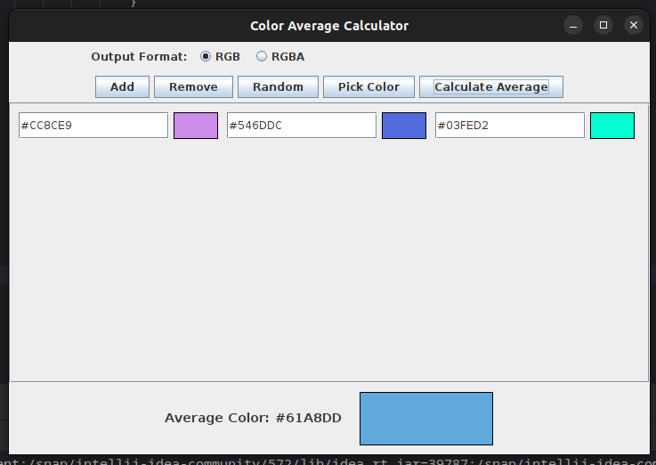

# Color Average Calculator

A Java Swing application that calculates the average color from mixed input formats (HEX, RGB, RGBA) with automatic format detection and real-time previews.

 *Add screenshot image later*

## Features

🎨 **Mixed Format Support**
- Automatically detects HEX (#RRGGBB, #RRGGBBAA), RGB (0-255 values), and RGBA inputs
- Supports parentheses variations: `(255, 99, 71)` or `255,99,71`
- Flexible alpha handling: `0.5` (float) or `127` (integer) in RGBA

🌈 **Smart Features**
- Real-time color previews for each input
- Automatic error highlighting for invalid formats
- Random color generator
- Integrated color picker
- Responsive wrap layout for color entries

📊 **Calculation**
- Accurate channel-wise averaging
- Optional alpha channel inclusion
- Results displayed in HEX format
- Full preview of average color

## Installation

1. **Requirements**
   - JDK 8 or newer
   - Maven 3.6+

2. **Run the application**
```bash
git clone https://github.com/yourusername/color-average-calculator.git
cd color-average-calculator
mvn clean install
mvn exec:java -Dexec.mainClass="dci.j24e01.Main"
```

## Usage

### Add Color Fields

Click "+ Add" to create new input fields

Use formats:

- **HEX:** `#ff6347` or `ff6347`
- **RGB:** `rgb(255,99,71)` or `255,99,71`
- **RGBA:** `rgba(255,99,71,0.5)` or `255,99,71,127`

### Choose Output Format

Select **RGB/RGBA** radio buttons for result format

### Special Functions

- 🎲 **Random:** Generate random colors
- 🎨 **Color Picker:** Select from color dialog
- 🗑️ **Remove:** Delete last color entry

### Calculate

Click **"Calculate Average"** to see result

Invalid fields will be highlighted in pink

## Example Inputs

Valid color formats:
```plaintext
#ff6347
(255,99,71)
255,99,71,0.5
(255, 99, 71, 127)
ff6347cc
```

## Contributing

Contributions are welcome! Please follow these steps:

1. Fork the repository
2. Create your feature branch (`git checkout -b feature/amazing-feature`)
3. Commit your changes (`git commit -m 'Add some amazing feature'`)
4. Push to the branch (`git push origin feature/amazing-feature`)
5. Open a Pull Request

## License

MIT License - see `LICENSE` file

---

Created with ❤️ by Inda :D

Part of Java Swing learning journey
